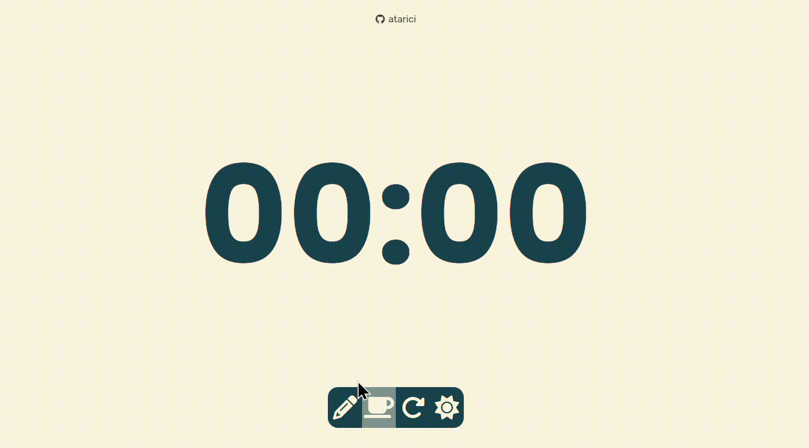

# POMODORO TIMER

### Pomodoro Timer that is made with Javascript.

  

### Features
* User's choice of theme is storaged in users's Local Storage.
* Study, Break and Reset Buttons.
* Responsive Design

  

You can also check out my other repo that i collected my own javascript projects. [Click here](https://github.com/atarici/javacsript-project-collection).
